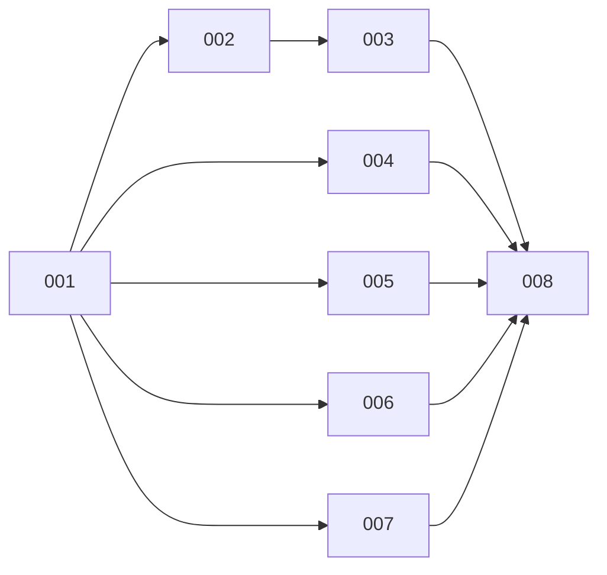

# Masterplan: tell-me-multi-source

## Overview

Eight phases. Phase 001 does the restructure and moves video to the new layout with no regressions. It also
freezes everything the later phases share: the router (all six sources are routed, and unbuilt ones exit with
"not supported yet"), the source contract, the `SKILL.md` router table linking all six `SUBSKILL.md` files (stubs
for now), and the per-folder prerequisite rule. After that, every source phase only adds files inside its own
`subskills/<s>/`, `scripts/<s>/` and `templates/<s>/`, so phases 002, 004, 005, 006 and 007 can run in parallel.
Phase 003 (hn) reuses the web extractor. Phase 008 finishes the library UI and the docs. See [spec.md](spec.md) and
[research](../../research/0003-tell-me-multi-source/research.md).

## Phase List

| Phase | Slug | Summary | Goals | Depends on | Wave | Status |
|-------|------|---------|-------|------------|------|--------|
| 001 | restructure-and-contract | new layout, shared/, router, contract, content.md migration, per-folder prereqs; video only | G1 G2 G3 G4 G5 | – | 01 | shipped  |
| 002 | web-source | trafilatura + defuddle (best wins) → Jina → Wayback; paragraph anchors | G2 G7 | 001 | 02 | shipped  |
| 003 | hn-source | Algolia tree, article + discussion, check_quotes.py, past discussions | G6 G7 | 001, 002 | 03 | shipped  |
| 004 | github-source | repo via API/gh + README, --deep repomix, issues/PRs/discussions, similar repos | G7 G9 G11 | 001 | 02 | shipped  |
| 005 | x-source | FxTwitter thread + replies, quoted posts, video part (transcript + download) | G6 G8 | 001 | 02 | shipped  |
| 006 | file-source | markitdown → pdftotext, original copied, page anchors, sha256 dedupe | G2 | 001 | 02 | shipped  |
| 007 | multi-input-digest | `prepare.py a b c`, generalized digest across sources | G10 | 001 | 02 | shipped  |
| 008 | library-ui-and-docs | sidebar source filter + icons, per-source header panels, README/plugin keywords, e2e | G2 G3 | 002–007 | 04 | shipped  |

## Dependencies

## Waves

_Advisory grouping by `depends_on` — cadence stays `phase` unless `--cadence wave`._

- Wave 01: 001
- Wave 02: 002, 004, 005, 006, 007 (each touches only its own source folders; 007 touches `scripts/shared/prepare.py` + digest template only)
- Wave 03: 003
- Wave 04: 008

## Risks

- **Restructure breaks the video skill** (imports, paths, library.js location, render of existing pages). Mitigation: 001 moves files with `git mv`, keeps every test, and adds an e2e test on a temp library before anything else.
- **Parallel phases collide in shared files.** Mitigation: 001 pre-registers all sources in `route.py`, `SKILL.md`, the aggregator prereq scripts and the render header dispatch, so wave-02 phases don't edit shared files (except 007).
- **Unofficial APIs** (FxTwitter, Jina, Algolia): each adapter has a fallback and fixture-based tests; failures exit 1 with the fallback that was tried.
- **Tool weight**: node becomes required for web (defuddle) and optional for github `--deep`; markitdown via `uvx` pulls a large dependency set on first run (message says so).
- **Library migration** (`transcript.md` → `content.md`) touches user data: dry-run by default, idempotent, tested on a temp library.

## Open Questions

None. All were decided in the spec grill (`grill.md`).

